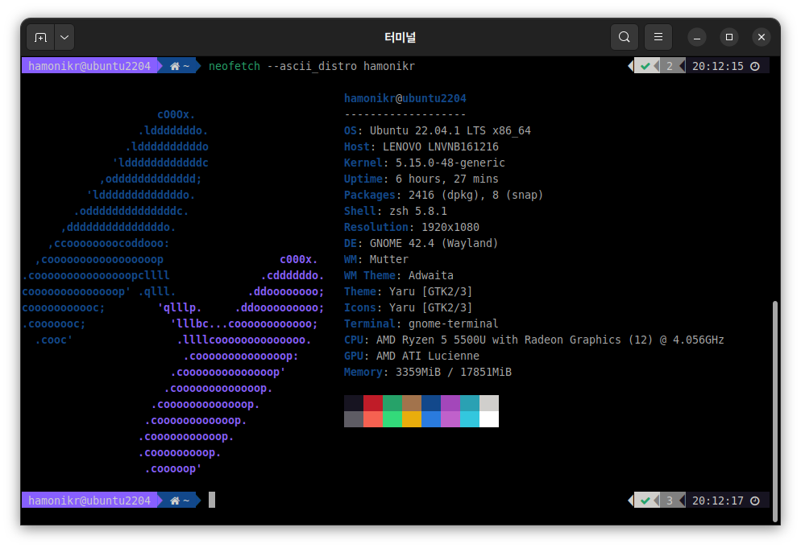

<h3 align="center"></h3>
<p align="center">A command-line system information tool written in bash 3.2+</p>

<p align="center">
<a href="./LICENSE.md"></a>
<a href="https://github.com/dylanaraps/neofetch/releases"></a>

This project origin is https://github.com/dylanaraps/neofetch

Neofetch는 터미널에서 시스템의 정보를 모두 보여주는 도구입니다. (`bash 3.2+`)

* 이 프로그램은 터미널에서 하모니카 OS 에 적합한 정보를 보여주도록 수정된 버전입니다.




## 설치하기

### ubuntu (>=22.04) , HamoniKR (>=6.0)
```
wget -qO- https://repo.hamonikr.org/hamonikr-app.apt | sudo -E bash -

sudo apt install neofetch
```

### ubuntu (<=20.04) , HamoniKR (<=5.0)
```
curl -sL https://pkg.hamonikr.org/add-hamonikr.apt | sudo -E bash -

sudo apt install neofetch
```

### Install from source
```
sudo make install
```

## How to build debian package on HamoniKR
```
git clone git@github.com:hamonikr/neofetch.git
cd neofetch
dpkg-buildpackage --sign-key=9FA298A1E42665B8
```